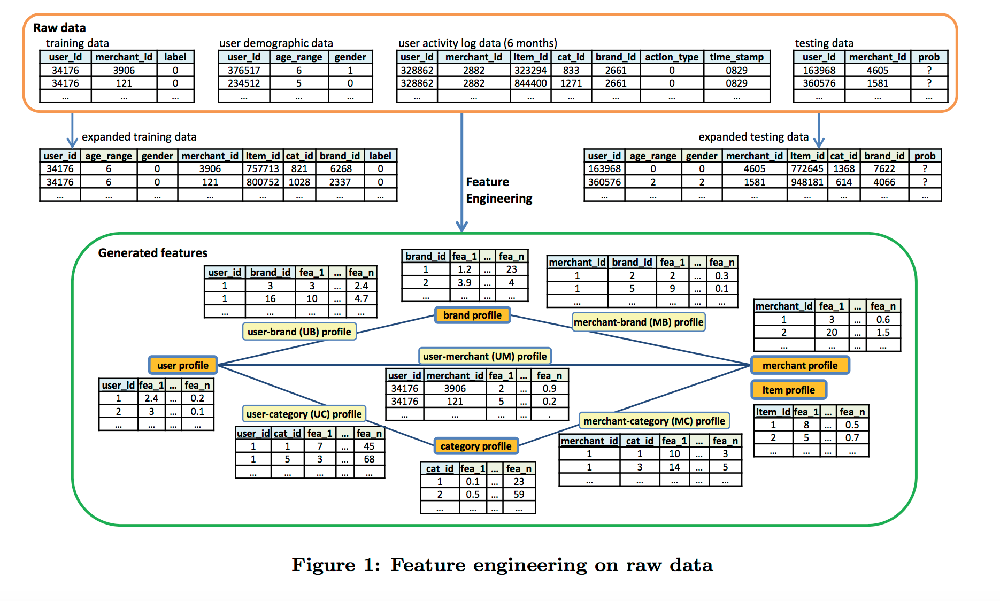

### Documents

### IJCAI 2015 competition
1. http://ijcai-15.org/index.php/repeat-buyers-prediction-competition (Xing xie suggested - IJCAI2015 Competition)
	* 컴페티션 요약: 알리바바가 2014년 Tmall.com에서의 Double 11 day(Biggest online shopping event)때의 repeated buy를 예측하는 모델을 만들어보고자 데이터를 IJCAI에 공개 
2. http://www.kdd.org/kdd2016/papers/files/adf0160-liuA.pdf  (IJCAI2015 winning solution)
	* 다양한 feature engineering 후 XGBoost를 기반으로 한 blending 예측 모델 생성, top features등을 서술.
	* 
3. http://kimiyoung.github.io/papers/fang-ijcai-2015.pdf  (IJCAI2015 2nd rank solution)
)

### Other competition (predict repeated buyers)
1. http://www.kdd.org/kdd2016/subtopic/view/repeat-buyer-prediction-for-e-commerce
2. http://mlwave.com/predicting-repeat-buyers-vowpal-wabbit/

### Research related
1. [A Brief Survey on Sequence Classification](../documents/Sequence_Classification.pdf)

